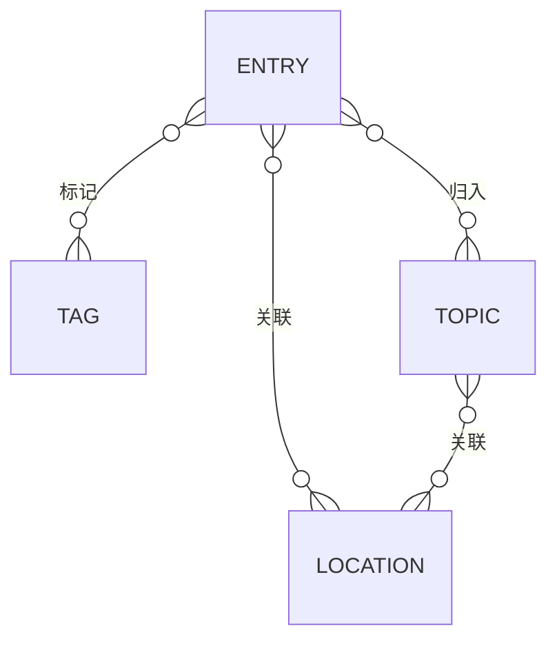
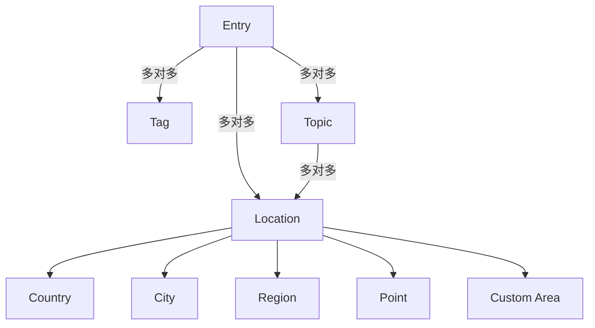

# DATA_MODEL.md

# 数据模型说明

> 版本：v0.3｜平台与数据持久化校准

## 1. 文档目的

本文件定义产品中的核心数据对象、字段及其关系。

它描述的是“产品世界里有哪些对象，它们如何连接”，而不是具体数据库 SQL 实现。

当前目标是为后续功能 Spec、技术架构、数据库设计和 Codex 开发提供统一的数据基础。

---

## 2. 核心对象总览

当前核心对象包括：

- `Entry`：用户保存的内容
- `Location`：空间锚点
- `Tag`：用户自定义的轻量分类
- `Topic`：可选的后期归纳层



核心原则：

1. Entry 是第一公民。
2. Location 用来决定内容“在哪里被重新发现”。
3. Tag 是轻量分类。
4. Topic 是后期归纳层，不是必填。
5. 一个 Entry 可以绑定多个 Location。
6. 一个 Entry 可以有多个 Tag。
7. 一个 Entry 可以属于多个 Topic。
8. 一个 Topic 可以关联多个 Location。

---

## 3. Entry

### 3.1 定义

Entry 是产品中最基础、最重要的数据对象。

用户在阅读、电影、音乐、播客、社交媒体、旅行或日常生活中遇到的文化内容、空间内容和个人灵感，都可以保存为 Entry。

Entry 可以独立存在，不要求先归类到 Topic。

### 3.2 Entry Type

V1 暂定：

- `book`：书籍
- `movie`：电影
- `music`：音乐
- `person`：人物
- `history_event`：历史 / 事件
- `place_space`：地点 / 空间
- `article_podcast`：文章 / 播客
- `other`：其他

产品界面可以显示中文名称，但底层建议使用稳定的英文枚举值。

### 3.3 Entry 字段

必填字段：

- `id`：唯一标识，系统生成
- `title`：Entry 标题
- `type`：Entry Type

核心可选字段：

- `note`：用户自己的备注、碎碎念、理解或提醒

其他可选字段：

- `source`：内容来源，例如豆瓣、小红书、播客、朋友聊天、某本书
- `creator`：作者、导演、音乐人等
- `year`：出版 / 上映 / 发行年份
- `cover`：封面或代表图片
- `external_link`：外部来源链接

自动字段：

- `created_at`
- `updated_at`

### 3.4 Entry 与 Location

Entry 与 Location 是多对多关系。

一个 Entry 可以关联多个 Location。

例如：

```text
某部电影
→ 巴黎
→ 维也纳
```

一个 Location 也可以关联很多 Entry。

V1 不要求区分主地点、次地点、关系强度或关系置信度。

### 3.5 Entry 与 Tag

Entry 与 Tag 是多对多关系。

例如：

```text
《少年来了》
→ #韩国文学
→ #民主化运动
```

### 3.6 Entry 与 Topic

Entry 与 Topic 是多对多关系。

Topic 不是必填。

一个 Entry 可以不属于任何 Topic，也可以属于一个或多个 Topic。

---

## 4. Location

### 4.1 定义

Location 是产品中的空间锚点。

Location 的作用不是严格定义“Entry 属于哪里”，而是回答：

> 未来当我浏览哪些地方时，希望重新看到这条 Entry？

因此，Entry 与 Location 之间允许存在宽泛、主观、非严格地理学意义上的关系。

### 4.2 Location Type

当前支持：

- `country`
- `city`
- `region`
- `point`
- `custom_area`

### 4.3 Location 通用字段

- `id`
- `name`
- `type`
- `parent_location_id`：可选，用于表达空间层级关系
- `created_at`

### 4.4 Country

表示国家级空间，例如法国、日本、韩国。

V1 中，国家通常来自地图或地理数据源，不需要用户自己创建。

### 4.5 City

表示城市，例如巴黎、光州、东京、维也纳。

城市本身通常不是用户“收藏”的内容，而是用于绑定 Entry 和浏览 Entry 的空间容器。

### 4.6 Region

表示标准地区、行政区域或较宽泛的标准地理单元，例如北海道、加利福尼亚州、巴伐利亚。

### 4.7 Point

表示精确地点，例如：

- 蒙帕纳斯公墓
- 某博物馆
- 某咖啡馆
- 某建筑
- 某纪念馆

Point 专属字段：

- `latitude`
- `longitude`

可选：

- `address`
- `place_name`

原则：

- 用户无需手动输入经纬度。
- 用户可以通过搜索或地图点击确定位置。
- 经纬度只作为底层实现数据。

### 4.8 Custom Area

表示用户自己定义的非标准空间区域。

适用于：

- 巴黎左岸
- 阿伊努文化相关区域
- 某部电影主要涉及的街区
- 用户个人定义的文化带

Custom Area 专属字段：

- `geometry`：Polygon / MultiPolygon 数据
- `description`：可选

产品原则：

- 不追求官方行政边界准确性
- 表达的是“我的空间理解”
- 视觉上应与正式行政区边界区分

V1 不要求完整实现 Polygon 编辑能力，可作为后续阶段能力。

---

## 5. Tag

### 5.1 定义

Tag 是用户自己创建的轻量分类。

系统不预设完整 taxonomy。

用户收藏什么，Tag 系统就随着使用逐渐生长。

### 5.2 Tag 字段

- `id`
- `name`
- `created_at`

可选：

- `color`：暂不建议 V1 必须实现

### 5.3 Tag 使用示例

```text
#博物馆
#墓地
#韩国文学
#民主化运动
#现代主义
#独立书店
```

Tag 可以用于任何 Entry Type。

### 5.4 Tag 关系

Entry ↔ Tag：多对多。

Tag 后续可以用于：

- Library 筛选
- 搜索
- 地图空间分布
- Topic 整理辅助

---

## 6. Topic

### 6.1 定义

Topic 是用户在长期积累后形成的专题性归纳。

Topic 不属于 Capture 阶段的必填对象。

### 6.2 Topic 字段

- `id`
- `title`
- `description`
- `note`
- `created_at`
- `updated_at`

可选：

- `cover`

### 6.3 Topic 与 Entry

Topic ↔ Entry：多对多。

例如：

```text
Topic：光州民主化运动

Entries:
- 《少年来了》
- 韩江
- 某部韩国电影
- 5·18纪念馆
- 历史笔记
```

### 6.4 Topic 与 Location

Topic ↔ Location：多对多。

例如：

```text
Topic：美国妇女参政运动

Locations:
- 华盛顿
- 纽约
- 塞内卡福尔斯
```

### 6.5 Topic 与 Tag

当前不强制建立 Topic ↔ Tag 的直接关系。

初期可以通过 Topic 中的 Entry 间接获得相关 Tag。

如果未来真实使用中发现有明确需求，再增加直接关系。

---

## 7. 关系表概念

从数据库实现角度，以下关系通常需要中间表。

当前仅做概念说明，不固定 SQL。

### 7.1 EntryLocation

- `entry_id`
- `location_id`
- `created_at`

V1 不加入 relation_type、relation_strength、confidence。

### 7.2 EntryTag

- `entry_id`
- `tag_id`

### 7.3 EntryTopic

- `entry_id`
- `topic_id`

### 7.4 TopicLocation

- `topic_id`
- `location_id`

---

## 8. 数据关系总览



---

## 9. 数据持久化、备份与所有权

本产品属于长期积累型个人数据产品。即使 V1 只提供 iPhone 客户端，也必须保证用户数据不会因为 App 重启、设备损坏或换机而永久丢失。

核心要求：

- App 重启后数据持续存在。
- 用户更换设备时应具备恢复路径。
- 长期积累的数据应支持可靠备份。
- 数据模型不绑定具体客户端，不因为当前只有 iPhone 而阻碍未来 Web 或其他端读取同一份业务数据。

当前不在 DATA_MODEL 中固定具体技术方案。以下实现可在 `ARCHITECTURE.md` 中继续比较：

- iCloud / CloudKit
- 云数据库
- Sign in with Apple + 云端数据
- 其他可靠同步 / 备份方案

账号并不是核心业务对象。若未来引入用户账号，建议为用户创建的数据预留 `owner_id` / `user_id` 的扩展能力，但 V1 数据模型不因此强制增加复杂账号字段。

---

## 10. 数据删除原则

### 10.1 删除 Entry

删除 Entry 时：

- 删除该 Entry 本身
- 删除 EntryLocation 关系
- 删除 EntryTag 关系
- 删除 EntryTopic 关系

但不自动删除 Location、Tag 或 Topic。

### 10.2 删除 Tag

删除 Tag 时：

- 删除 Tag
- 删除所有 EntryTag 关系

但不删除任何 Entry。

### 10.3 删除 Topic

删除 Topic 时：

- 删除 Topic
- 删除 EntryTopic 关系
- 删除 TopicLocation 关系

但不删除其中的 Entry 或 Location。

### 10.4 删除 Location

标准 country / city / region 通常来自系统地理数据，不建议用户直接删除。

用户创建的 Point / Custom Area 可以删除，但删除前应检查是否仍有 Entry 或 Topic 关联。

---

## 11. V1 数据模型范围

V1 必须支持：

### Entry

- title
- type
- note
- source
- creator
- year
- cover
- external_link
- created_at
- updated_at

### Location

- country
- city
- region
- point

### Tag

- 用户创建
- Entry 多 Tag

### 关系

- Entry ↔ Location
- Entry ↔ Tag

### 基础数据操作

- 创建
- 查看
- 编辑
- 删除
- 搜索
- 筛选

---

## 12. V1 可后置能力

以下能力不要求第一版数据库就完整实现：

- Topic 完整专题体系
- Custom Area / Polygon
- Topic ↔ Location
- 豆瓣数据同步
- AI 自动建议 Location
- AI 自动建议 Tag
- AI 自动生成 Topic
- 去过 / 未去过状态
- 旅行时间线
- Entry 之间的复杂关系
- 关系强度
- 空间关系语义
- 多人协作
- 社交关系

---

## 13. 数据模型设计原则

1. **Entry 优先**：所有内容首先都可以作为独立 Entry 存在。
2. **Location 是关联，不是归属**：不要求建立客观正确的地理知识图谱。
3. **支持多 Location**：不强迫文化内容只能属于一个地方。
4. **Tag 自由生长**：不建立庞大的预设分类体系。
5. **Topic 后置**：用户先积累，之后再归纳。
6. **数据字段保持最少**：不把产品做成完整媒体数据库、GIS 系统或旅行平台。
7. **允许未来扩展**：当前结构要能支持 Topic、Polygon、外部数据和 AI，但不要提前实现全部能力。
8. **用户不应接触底层技术字段**：经纬度、geometry、数据库 ID 等只服务系统实现，不进入核心录入体验。
9. **客户端与数据解耦**：iPhone 是首要客户端，但业务数据结构不绑定 iOS UI。
10. **长期数据可靠性优先**：备份与恢复是基础能力，登录只在需要同步身份时引入。

---

## 14. 后续需要确认的问题

这些问题可以在具体 Spec 或架构阶段继续确定：

- Location 是否全部来自统一地理数据源。
- City / Region 的 parent hierarchy 如何建立。
- Point 搜索使用哪种地图 / 地理编码服务。
- 用户是否可以创建不存在于地图数据源中的自定义名称 Location。
- Tag 是否区分大小写。
- Tag 是否允许重名。
- Entry Type 是否未来允许自定义。
- Topic 是否进入 V1，还是完整后置到 P1。
- Custom Area 的 Polygon 数据格式和编辑方式。
- 豆瓣等外部元数据如何与用户 Entry 数据隔离。
