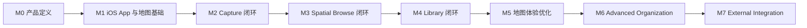
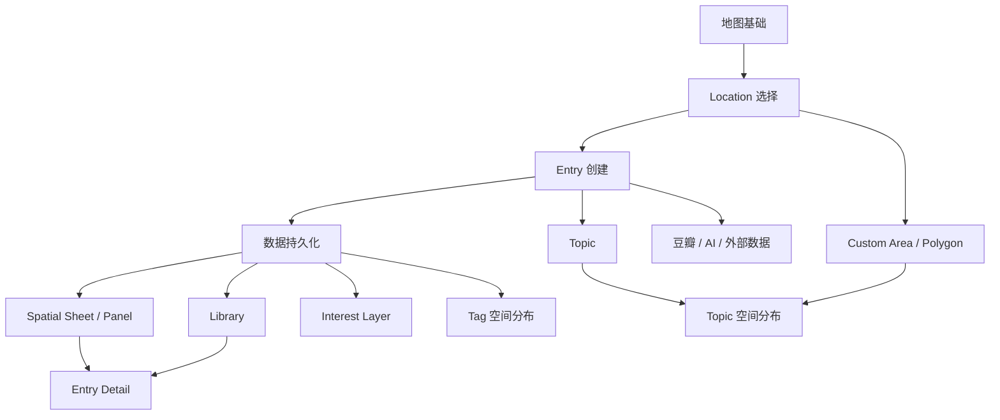

# ROADMAP.md

# 产品路线图

> 版本：v0.3｜平台校准：iPhone-first

## 1. 总体路径



这份 Roadmap 的排序原则不是“功能看起来有多重要”，而是：

1. **先跑通核心产品闭环**
2. **先做其他功能的前置依赖**
3. **优先验证最核心的产品假设**
4. **把容易膨胀、但不是 V1 必需的功能后置**
5. **优先做纵向闭环，而不是横向铺满页面**

核心闭环是：

> 添加 Entry → 绑定 Location → 保存 → 在地图上点击空间 → 看到相关 Entry → 打开 Entry Detail

只要这条链路完整跑通，产品就已经具备最基本的可用价值。

---

## 2. M0｜产品定义

### 目标

把产品定位、核心对象、用户场景和 V1 边界定义清楚，在进入编码前降低后续反复重构的风险。

### 主要产物

- `PRODUCT.md`
- `ROADMAP.md`
- `DATA_MODEL.md`
- `DESIGN.md`
- `MAP_DESIGN.md`
- 核心功能 Specs
- `ARCHITECTURE.md`
- `AGENTS.md`

### 当前已基本确认

- 产品是私人文化地图，而不是普通地点收藏地图。
- Entry 是第一公民。
- Location 是独立空间锚点。
- 一个 Entry 可以关联多个 Location。
- Tag 是用户自由生长的轻量分类。
- Topic 是可选的后期归纳层。
- Map 与 Library 分别承担空间浏览与内容浏览。
- 默认点击地图用于查看；添加需要显式进入添加模式。
- 地图保持简洁，不默认展示大量 Entry。

### 完成条件

- 核心产品定义不再存在重大歧义。
- Entry / Location / Tag / Topic 模型确认。
- V1 核心交互链路确认。
- 技术实现前所需的关键 Spec 已完成。

---

## 3. M1｜iOS App 与地图基础

### 目标

先建立一个可以在 iPhone 上稳定运行的 App 骨架，并搭好干净、稳定、可漫游的地图基础。

这一阶段以 iPhone 真机体验为主要验收对象；Windows 是主要开发环境，Web 不作为 V1 必需端。

这一阶段不做复杂内容系统，只解决：

> 地图本身能不能成为一个令人愿意停留的核心界面？

### 包含功能

#### App Foundation

- Windows 可开发的 iOS-first App 项目基础（具体技术栈由 `ARCHITECTURE.md` 确定）
- iPhone Safe Area 与基础导航结构
- 基础 Light / Dark Mode 系统适配
- 中文 / English 国际化基础
- iPhone 真机测试流程
- 数据持久化与未来备份 / 恢复能力的架构预留

#### Map Foundation

- 基础地图加载
- 缩放
- 拖动
- 世界 / 国家 / 城市级浏览
- 国家、主要城市、水域、必要边界
- 基础地图点击识别
- 简洁地图视觉基线
- 初步 Zoom Level 信息层级

### 暂不包含

- Entry marker
- Interest Layer
- Topic / Tag 空间分布
- Polygon
- Library
- 豆瓣联动
- Web 客户端

### 完成条件

- App 可以在 iPhone 真机上稳定运行。
- 地图加载稳定。
- 缩放和拖动正常。
- 地图在主要 Zoom Level 下不拥挤。
- 国家、主要城市、陆地、水域层级清楚。
- 点击国家 / 城市可以识别当前空间对象。

### 为什么先做

地图是产品的核心交互入口，也是后续 Location 绑定和空间浏览的基础依赖。与此同时，iPhone-first 的基础结构需要尽早稳定，避免后续用桌面交互逻辑反向改造手机端。

---

## 4. M2｜Capture 闭环

### 目标

完成产品最重要的行为：

> 用户遇到一条文化灵感时，可以快速记录下来并绑定到空间。

### 包含功能

#### Add Entry

- 全局 `+ 添加`
- 输入标题
- 选择 Entry Type
- 填写 Note
- 添加 Tag
- 添加 Source
- 可选填写 Creator / Year / Cover / External Link

#### Location 绑定

支持：

- country
- city
- region
- point

Location 选择方式：

- 搜索
- 在地图上选择

支持：

- 一个 Entry 绑定多个 Location

#### 保存

- Entry 写入数据库
- Entry 与 Location 的关联被保存
- Tag 被保存或复用
- App 重新打开后数据仍存在

### 暂不包含

- Topic
- Custom Area / Polygon
- AI 自动识别地点
- 豆瓣导入
- 自动元数据抓取

### 最小验证场景

用户可以完成：

> 添加《小王子》 → Type 选择书籍 → Location 选择法国 → 写一段备注 → 保存

### 完成条件

- 可以完整创建 Entry。
- 可以绑定一个或多个 Location。
- 可以保存 Tag 和 Note。
- App 重新打开后数据不丢失。
- 添加过程不依赖复杂分类。

### 为什么排在这里

这是产品最高频、最核心的输入行为。

如果 Capture 不够顺畅，后面的地图漫游和知识积累都没有意义。

---

## 5. M3｜Spatial Browse 闭环

### 目标

让用户真正从地图进入自己的文化内容。

核心链路：

> Map → 点击空间 → Spatial Sheet / Panel → Entry → Entry Detail

### 包含功能

#### 地图点击

默认状态下：

- 点击国家 = 查看
- 点击城市 = 查看
- 点击地区 = 查看

不是添加。

#### Spatial Sheet / Panel

点击某个空间后，打开 Spatial Sheet / Panel。

- iPhone：优先使用 Bottom Sheet，地图保持在背景中。
- 未来 iPad / Web：可以根据屏幕空间使用 Side Panel。

显示：

- 空间名称
- Entry 总数
- Entry Type 分布
- 最近或相关 Entry
- Tag 概览

#### Entry Detail

点击 Entry 后查看：

- 标题
- Type
- Location
- Note
- Tag
- Creator / Year 等可选信息
- Source / External Link

#### 基础编辑

- 编辑 Entry
- 删除 Entry
- 修改 Location
- 修改 Tag
- 修改 Note

### 暂不包含

- Interest Layer
- Topic 专题
-复杂地图分析

### 最小验证场景

> 点击巴黎 → 看到与法国关联的《小王子》 → 打开详情 → 修改备注

### 完成条件

- 从地图点击一个空间可以看到相关 Entry。
- Entry Detail 可正常打开。
- Entry 可以编辑和删除。
- 地图始终保持为主要视觉上下文。

### 为什么排在这里

M2 解决“存进去”，M3 解决“重新找回来”。

两者共同构成产品的第一个完整闭环。

---

## 6. M4｜Library 闭环

### 目标

建立一个非空间化的内容管理入口，补足地图浏览不适合精确查找的问题。

### 包含功能

- 全部 Entry 列表
- 搜索
- Type 筛选
- Tag 筛选
- Entry Detail
- 编辑
- 删除
- 排序
- 基础数据统计

### 顶层结构

V1 尽量只保留两个一级入口：

- Map
- Library

避免把 Books、Movies、Topics、Tags、Places 等拆成独立一级导航。

### 完成条件

- 用户可以通过关键词找到任意 Entry。
- 可以按 Type 和 Tag 筛选。
- 地图之外也可以管理内容。
- Map 与 Library 之间的数据保持一致。

### 为什么排在地图浏览之后

Library 很重要，但不是产品差异化的核心。

先验证“空间浏览”成立，再补充通用内容管理。

---

## 7. M5｜地图体验优化

### 目标

在核心数据和浏览闭环稳定后，进一步强化“属于我的世界地图”的体验。

### 包含功能

#### Interest Layer

- 根据不同空间下的 Entry 数量显示轻量 tonal shading
- 保持低饱和、低对比
- 不使用传统高强度热力图

#### Tag 空间分布

例如：

`#博物馆`

→ 查看全球收藏博物馆的空间分布

#### Topic 空间分布

当 Topic 基础能力存在后，可以查看 Topic 涉及的区域。

#### Point Marker

精确地点 Entry：

- 世界 / 国家尺度隐藏
- 城市 / 街区尺度逐步显示

#### Progressive Disclosure

继续优化：

- 国家
- 城市
- 行政边界
- 精确地点
- Label Density

在不同 Zoom Level 下逐步出现。

### 完成条件

- 默认地图仍然简洁。
- Interest Layer 能直观看到兴趣分布。
- 开启 Tag 筛选后，地图能反映相应空间分布。
- 高 Zoom Level 下可以看到精确地点，但不会造成拥挤。

### 为什么后置

它依赖稳定的 Entry / Location 数据。

在数据不足时，过早做 Interest Layer 意义有限。

---

## 8. M6｜Advanced Organization

### 目标

在用户已经积累足够 Entry 后，支持更高层次的整理和归纳。

### 8.1 Topic

支持：

- 创建 Topic
- 添加标题
- 描述
- Note
- 关联多个 Entry
- 关联多个 Location
- 从已有 Entry 中整理 Topic

例如：

**法国文学想象**

可关联：

- 《小王子》
- 圣埃克苏佩里
- 相关法国电影
- 5·18纪念馆
- 历史笔记

### 8.2 Custom Area / Polygon

支持用户手动圈选自定义空间区域。

适合：

- 巴黎左岸
- 华北平原相关区域
- 某个电影空间
- 用户自定义文化带

原则：

- 不追求官方行政精度
- 明确区别于正式行政边界
- 用于表达“我的空间理解”

### 完成条件

- Topic 不影响无 Topic Entry 的正常使用。
- 用户可以把已有碎片整理成 Topic。
- Polygon 可以作为可选 Location 被 Entry 或 Topic 关联。

### 为什么后置

这些能力只有在用户已经积累足够内容以后才真正有价值。

---

## 9. M7｜External Integration

### 目标

在核心产品逻辑验证后，再降低大量文化内容录入的成本。

### 可能功能

#### 豆瓣联动

- 导入书籍
- 导入电影
- 导入音乐
- 补充封面、作者、年份等元数据

#### AI 辅助

- 根据作品名称建议可能的 Location
- 根据已有 Entry 建议 Tag
- 根据长期积累建议可能形成的 Topic
- 辅助整理已有碎片

#### 其他外部数据

- 书影音元数据库
- 地理搜索服务
- 数据批量导入 / 导出

### 原则

外部服务只负责：

> 帮助用户更快建立自己的数据。

不改变产品核心：

> 用户自己决定什么内容与什么空间发生关系。

### 为什么最后做

外部 API、自动化和 AI 都容易显著增加技术复杂度。

必须先验证手动 Capture 本身是否值得长期使用。

---

## 10. Later｜暂不承诺

以下方向暂时只作为未来探索，不进入当前版本承诺：

- 当前所在地附近的历史收藏
- 旅行照片
- 去过 / 未去过状态
- 旅行时间线
- 足迹统计
- 完整旅行日记
- 路线规划
- 攻略生成
- 分享
- 社交
- 多人协作
- 内容社区
- 复杂知识图谱
- Web 客户端
- 完整多端账号体系（仅在确有同步需求时实现）

是否加入，应根据真实长期使用反馈决定。

---

# 11. 功能依赖关系



---

# 12. 开发原则

每个 Milestone 内继续拆成独立 Spec 和 Issue。

推荐循环：

```text
Spec
↓
Codex Inspect
↓
Plan
↓
Implement
↓
Build / Typecheck
↓
手动测试
↓
修复
↓
Git Commit
```

每次只解决一个明确问题。

不要在同一个 Issue 中同时开发：

- 地图视觉
- Library
- Topic
- 数据导入
- AI

除非它们属于同一个无法拆分的核心闭环。

---

# 13. 当前建议开发顺序

实际进入编码后，优先级建议：

1. 地图基础
2. Entry 最小数据结构
3. Location 数据结构
4. Add Entry
5. Location 搜索 / 地图选择
6. 数据持久化
7. Spatial Sheet / Panel
8. Entry Detail
9. 编辑 / 删除
10. Library
11. 搜索 / Type / Tag 筛选
12. 地图视觉进一步优化
13. Interest Layer
14. Tag 空间分布
15. Topic
16. Custom Area / Polygon
17. 豆瓣导入
18. AI / 外部集成

---

# 14. V1 的真正完成标准

V1 不是“页面都做出来了”。

V1 的完成标准是用户能够完整完成：

> 我看到一个与某地有关的文化内容  
> → 快速创建 Entry  
> → 绑定一个或多个 Location  
> → 保存  
> → 以后重新打开地图  
> → 点击这个国家 / 城市 / 地区  
> → 找回这条 Entry  
> → 阅读或编辑自己的 Note

并且：

- 地图仍然简洁。
- 数据不会因 App 重启而丢失，并具备可靠备份 / 恢复路径。
- 用户不需要先整理 Topic。
- 用户不需要输入复杂地理数据。
- 整个产品没有被额外旅行功能干扰。

这条闭环稳定之后，才进入更复杂的组织、地图分析和外部联动能力。
